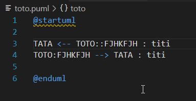
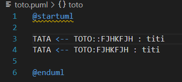

# plantuml-switcher

**plantuml-switcher** is a Visual Studio Code extension designed to simplify editing PlantUML relation lines. It allows you to quickly reverse the direction of an arrow and swap the source and target parts of a PlantUML relation—all by placing your cursor on the line and pressing the assigned key.

## Features

- **Switch PlantUML Relations:**  
  Automatically reverse the arrow direction and swap the source and target blocks in a PlantUML relation.
  
- **Switch PlantUML Layouts options for links:**  
  Automatically insert [norank] and [hidden] layout options in a PlantUML link.
  
- **Quick Keybinding:**  
  Simply place your cursor on the line you want to switch and press the configured key (default is `²`).

- **Easy to Use:**  
  Works out-of-the-box without any additional configuration.

## Requirements

- Visual Studio Code version **1.88.0** or later.

## Extension Settings

This extension works with its default settings and does not require any additional configuration.  
*Note: In previous iterations, a setting for the namespace operator was considered, but the current version operates solely based on the syntax of the PlantUML line.*

## Known Issues

- No known issues at the moment. If you encounter any bugs or unexpected behavior, please open an issue on the repository.

## Config

For some users, the default key '²' will not been defined after install  
So you need to map a key for the shortcut 'plantuml-switcher.relation'

## Usage

== Line switching ==
1. Open any file in Visual Studio Code with PlantUml content.
2. Place your cursor on a line containing a PlantUML relation 
3. Press the key bound to the command (default key: `²`).
4. The extension will automatically switch the line

== Link switching ==
1. Open any file in Visual Studio Code with PlantUml content.
2. Place your cursor inside a PlantUml link 
3. Press the key bound to the command (default key: `²`).
4. The extension will automatically switch the link 
   

## Know issues

Where there is no spaces between a link and tokens ex : "TOTO<--TATA", the switching will not been applied.  
This issue will not been solved.  
The correction for make is work is : "TOTO <-- TATA"

## Release Notes

### 1.0.3

- if one char at least to any lines are selected, and inversion is applied for the whole block

### 1.0.2

- Fig a bug where an indentation prevent the switching to be applied

### 1.0.1

- Insert [norank], [hidden] or nothing when the cursor in on the link cyclically

### 1.0.0

- Initial release of plantuml-switcher.
- Added functionality to switch PlantUML relation lines.

**Enjoy switching your PlantUML relations with ease!**
